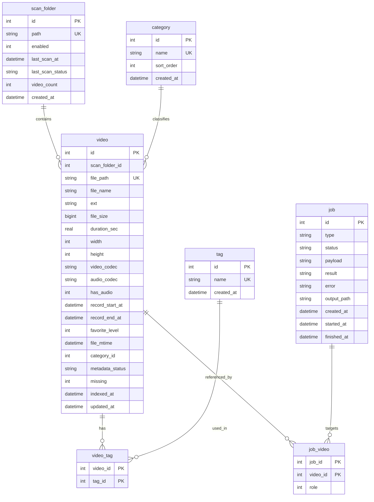

# 个人视频管理工具 — 数据库设计文档

| 项目 | 内容 |
|------|------|
| 文档名称 | 个人视频管理工具 数据库设计文档 |
| 版本 | v1.3 |
| 日期 | 2026-06-01 |
| 状态 | 评审中 |
| 数据库 | SQLite 3 |
| 关联文档 | PRD、API、FFmpeg 策略、工程约定 dev-guide |

> 说明：本文档描述数据存储实现。业务规则见 PRD。**不使用数据库外键**，表间关系由应用层维护。

---

## 1. 设计概述

### 1.1 选型

- **SQLite**：单机、零配置，足以承载 5 万+ 视频元数据与标注。
- 通过应用层（如 SQLAlchemy）访问。

### 1.2 命名规范

| 项目 | 规范 |
|------|------|
| 表名 | 小写蛇形，单数 |
| 字段名 | 小写蛇形 |
| 主键 | `id`，自增整数 |
| 逻辑关联字段 | `<表名>_id`（如 `category_id`），**仅逻辑引用，不建外键** |
| 时间字段 | 类型 **DATETIME**，格式见 §1.3 |
| 布尔字段 | INTEGER（0/1） |

### 1.3 时间字段约定

**统一格式：** `YYYY-MM-DD HH:MM:SS`（本地时间字面量，字符串存储）

| 类别 | 字段示例 | 规则 |
|------|----------|------|
| **画面录制时间** | `record_start_at`、`record_end_at` | 用户对照画面人工录入的「钟面时间」，**不做时区转换**，存什么显示什么 |
| **系统/业务时间** | `file_mtime`、`indexed_at`、`updated_at`、`created_at`、`last_scan_at` 等 | 记录本地时刻，同样使用上述格式，**不使用 UTC** |
| **空值** | 录制时间未填 | `NULL` |

> 录制时间与 `file_mtime` 语义不同：前者是画面 OSD 时间，后者是文件系统修改时间。

### 1.4 其他约定

- 文件绝对路径 `file_path` 为业务唯一标识。
- 表间完整性（删除分类、删除标签、删除扫描文件夹等）由**应用层**处理，不依赖数据库外键级联。

---

## 2. ER 图（逻辑关系，无外键）



---

## 3. 表结构明细

### 3.1 scan_folder（扫描文件夹）

| 字段 | 类型 | 约束 | 默认 | 说明 |
|------|------|------|------|------|
| id | INTEGER | PK, AUTOINCREMENT | | 主键 |
| path | TEXT | NOT NULL, UNIQUE | | 绝对路径 |
| enabled | INTEGER | NOT NULL | 1 | 是否启用（0/1） |
| last_scan_at | DATETIME | NULL | | 上次扫描完成时间 |
| last_scan_status | TEXT | NOT NULL | 'idle' | idle/scanning/success/failed |
| video_count | INTEGER | NOT NULL | 0 | 已索引视频数（缓存） |
| created_at | DATETIME | NOT NULL | CURRENT_TIMESTAMP | 创建时间 |

### 3.2 video（视频）

| 字段 | 类型 | 约束 | 默认 | 说明 |
|------|------|------|------|------|
| id | INTEGER | PK, AUTOINCREMENT | | 主键 |
| scan_folder_id | INTEGER | NOT NULL | | 所属扫描文件夹（逻辑关联） |
| file_path | TEXT | NOT NULL, UNIQUE | | 文件绝对路径 |
| file_name | TEXT | NOT NULL | | 文件名（含扩展名） |
| ext | TEXT | NOT NULL | | mp4 / mov |
| file_size | INTEGER | NOT NULL | 0 | 字节数 |
| duration_sec | REAL | NULL | | 时长（秒） |
| width | INTEGER | NULL | | 宽（像素） |
| height | INTEGER | NULL | | 高（像素） |
| video_codec | TEXT | NULL | | ffprobe 视频编码（如 h264、hevc） |
| audio_codec | TEXT | NULL | | ffprobe 音频编码（如 aac） |
| has_audio | INTEGER | NOT NULL | 1 | 是否存在音频轨（0/1）；0 时禁止截取/合并 |
| record_start_at | DATETIME | NULL | | 画面内录制开始时间（人工录入） |
| record_end_at | DATETIME | NULL | | 画面内录制结束时间（人工录入） |
| favorite_level | INTEGER | NOT NULL, CHECK(0..10) | 0 | 喜爱度，0=未设置，1～10 |
| file_mtime | DATETIME | NULL | | 文件修改时间 |
| category_id | INTEGER | NULL | | 分类（逻辑关联，可空） |
| metadata_status | TEXT | NOT NULL | 'pending' | pending/ready/failed |
| missing | INTEGER | NOT NULL | 0 | 是否缺失（0/1） |
| indexed_at | DATETIME | NOT NULL | CURRENT_TIMESTAMP | 首次入库 |
| updated_at | DATETIME | NOT NULL | CURRENT_TIMESTAMP | 最近更新 |

**应用层约束：**
- `favorite_level` 范围 0～10
- 删除分类时：将相关 `video.category_id` 置 `NULL`
- 删除标签时：删除对应 `video_tag` 行
- 删除扫描文件夹时：按用户选择保留或删除其下 `video` 记录

### 3.3 category（分类）

| 字段 | 类型 | 约束 | 默认 | 说明 |
|------|------|------|------|------|
| id | INTEGER | PK, AUTOINCREMENT | | 主键 |
| name | TEXT | NOT NULL, UNIQUE | | 分类名 |
| sort_order | INTEGER | NOT NULL | 0 | 排序 |
| created_at | DATETIME | NOT NULL | CURRENT_TIMESTAMP | 创建时间 |

### 3.4 tag（标签）

| 字段 | 类型 | 约束 | 默认 | 说明 |
|------|------|------|------|------|
| id | INTEGER | PK, AUTOINCREMENT | | 主键 |
| name | TEXT | NOT NULL, UNIQUE | | 标签名 |
| created_at | DATETIME | NOT NULL | CURRENT_TIMESTAMP | 创建时间 |

### 3.5 video_tag（视频-标签关联）

| 字段 | 类型 | 约束 | 说明 |
|------|------|------|------|
| video_id | INTEGER | PK | 视频 id（逻辑关联） |
| tag_id | INTEGER | PK | 标签 id（逻辑关联） |

联合主键 `(video_id, tag_id)`。

### 3.6 job（任务）

| 字段 | 类型 | 约束 | 默认 | 说明 |
|------|------|------|------|------|
| id | INTEGER | PK, AUTOINCREMENT | | 主键 |
| type | TEXT | NOT NULL | | scan_folder/scan_all/video_clip/merge_videos |
| status | TEXT | NOT NULL | 'queued' | queued/running/success/failed |
| payload | TEXT | NULL | | JSON 入参 |
| result | TEXT | NULL | | JSON 结果 |
| error | TEXT | NULL | | 错误信息 |
| output_path | TEXT | NULL | | 输出文件路径 |
| created_at | DATETIME | NOT NULL | CURRENT_TIMESTAMP | 创建 |
| started_at | DATETIME | NULL | | 开始 |
| finished_at | DATETIME | NULL | | 结束 |

### 3.7 job_video（任务-视频关联）

| 字段 | 类型 | 约束 | 说明 |
|------|------|------|------|
| job_id | INTEGER | PK | 任务 id |
| video_id | INTEGER | PK | 视频 id |
| role | INTEGER | NOT NULL DEFAULT 0 | 合并顺序等 |

---

## 4. 索引设计

| 索引 | 表 | 字段 | 目的 |
|------|----|------|------|
| ux_video_file_path | video | file_path | 唯一、增量扫描 |
| ix_video_folder | video | scan_folder_id | 按文件夹统计 |
| ix_video_category | video | category_id | 分类筛选 |
| ix_video_favorite | video | favorite_level | 喜爱度筛选/排序 |
| ix_video_record_start | video | record_start_at | 录制开始时间筛选 |
| ix_video_record_end | video | record_end_at | 录制结束时间筛选 |
| ix_video_missing_status | video | missing, metadata_status | 列表过滤 |
| ix_video_mtime | video | file_mtime | 排序 |
| ix_videotag_tag | video_tag | tag_id | 标签 AND |
| ux_category_name | category | name | 唯一 |
| ux_tag_name | tag | name | 唯一 |
| ix_job_status | job | status, type | 任务查询 |

---

## 5. 关键查询示例

### 5.1 列表分页

```sql
SELECT *
FROM video
WHERE missing = 0
ORDER BY file_mtime DESC
LIMIT :page_size OFFSET :offset;
```

### 5.2 多条件筛选

```sql
SELECT *
FROM video
WHERE missing = 0
  AND category_id = :category_id
  AND favorite_level >= :favorite_min
  AND record_start_at IS NOT NULL
  AND record_start_at BETWEEN :start_from AND :start_to
ORDER BY favorite_level DESC, file_mtime DESC
LIMIT :page_size OFFSET :offset;
```

### 5.3 标签 AND

```sql
SELECT v.*
FROM video v
JOIN video_tag vt ON vt.video_id = v.id
WHERE vt.tag_id IN (:tag_ids)
  AND v.missing = 0
GROUP BY v.id
HAVING COUNT(DISTINCT vt.tag_id) = :tag_count
ORDER BY v.file_mtime DESC
LIMIT :page_size OFFSET :offset;
```

---

## 6. 状态字段枚举

| 字段 | 取值 | 含义 |
|------|------|------|
| scan_folder.last_scan_status | idle / scanning / success / failed | 扫描状态 |
| video.metadata_status | pending / ready / failed | 元数据状态 |
| video.missing | 0 / 1 | 文件缺失 |
| video.favorite_level | 0~10 | 喜爱度 |
| video.ext | mp4 / mov | 格式 |
| job.type | scan_folder / scan_all / video_clip / merge_videos | 任务类型 |
| job.status | queued / running / success / failed | 任务状态 |

---

## 7. 数据完整性（应用层）

| 规则 | 应用层处理 |
|------|-----------|
| file_path 唯一 | 插入前检查；增量扫描按路径 upsert |
| favorite_level 0～10 | 写入前校验 |
| 删除分类 | `UPDATE video SET category_id = NULL WHERE category_id = ?` |
| 删除标签 | `DELETE FROM video_tag WHERE tag_id = ?` |
| 删除视频 | `DELETE FROM video_tag WHERE video_id = ?`；`DELETE FROM job_video WHERE video_id = ?` |
| 删除任务 | `DELETE FROM job_video WHERE job_id = ?` |

---

## 8. 数据生命周期

| 事件 | 行为 |
|------|------|
| 快速扫描新文件 | 插入 video，metadata_status=pending |
| 元数据补全 | 更新 duration/分辨率/codec，metadata_status=ready |
| 文件变更 | 更新元数据；**保留**标注与录制时间 |
| 文件缺失 | missing=1 |
| 单视频剪辑完成 | 更新 file_path 等，保留标注 |
| 多视频合并完成 | 新建 video；源记录 missing 或删除（实现约定见 API） |

---

## 9. 迁移与初始化

- 建表脚本创建全部表与索引。
- **不启用** `PRAGMA foreign_keys`。
- 建议 `PRAGMA journal_mode = WAL;` 以改善读写并发。

---

## 10. 容量与性能预估

| 项目 | 估算 |
|------|------|
| video 行数 | 5 万+ |
| 数据库体积 | 数十 MB 级 |
| 分页查询 | 毫秒级（配合索引） |

---

## 变更记录

| 版本 | 日期 | 说明 |
|------|------|------|
| v1.0 | 2026-06-01 | 初版 |
| v1.1 | 2026-06-01 | 去除外键；时间统一 DATETIME 本地格式；录制时间不做 UTC；新增 video_codec/audio_codec |
| v1.2 | 2026-06-01 | 新增 has_audio；job.type 使用 video_clip |
| v1.3 | 2026-06-01 | favorite_level 改为 0～10 |
