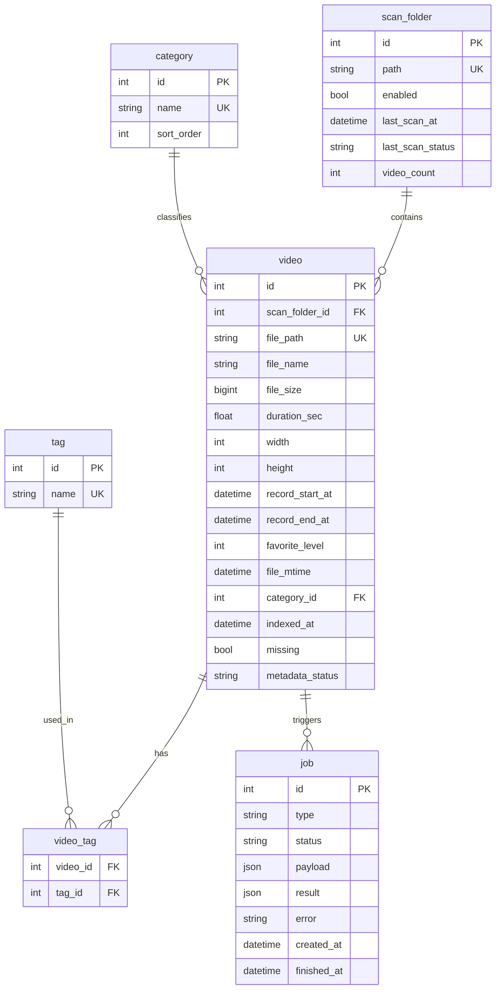

# 个人视频管理工具 — 产品设计与开发文档

> ⚠️ **历史备份文档 — 禁止作为开发或 AI 实现依据**  
> 正式规格请使用：`2026-06-01-video-manager-prd.md`、`database.md`、`api.md`、`ffmpeg-strategy.md`、`dev-guide.md`

> 版本：v1.3（已归档）  
> 日期：2026-06-01  
> 状态：仅备份  
> 架构方案：**方案 1 — Python FastAPI + SQLite + React + FFmpeg**

---

## 一、产品定位

**一句话：** 面向 Windows 本地、5 万+ 视频（mp4/mov）的个人视频库管理工具，支持手动配置文件夹扫描、分页浏览、播放标注（分类+标签+录制起止时间+喜爱度）、按条件检索，以及单视频多段截取合并 / 多视频合并；替换原文件时源文件进入回收站。

| 维度 | 说明 |
|------|------|
| 使用者 | 仅本人，Windows 单机 |
| 部署形态 | 本地 Web（浏览器访问 `http://localhost:8765`） |
| 数据规模 | 5 万+ 视频，单文件 100MB～2GB，格式为 **mp4、mov** |
| 存储现状 | 同一盘符下多个文件夹，命名与目录较乱 |
| 扫描策略 | **手动添加扫描文件夹**，不扫整个盘符 |
| 非目标（v1） | 云端同步、多用户、人脸识别、未标注队列、标签颜色、FFmpeg 抽帧缩略图 |

---

## 二、架构方案（已选定）

### 方案 1：Python FastAPI + SQLite + React + FFmpeg

```
浏览器(React) ←→ FastAPI ←→ SQLite(元数据/标签/扫描目录)
                    ↓
              FFmpeg / ffprobe(截取/合并/元数据)
              文件夹级扫描(≤500 文件/次，可同步)
              本地文件系统(mp4/mov)
```

| 优点 | 缺点 |
|------|------|
| 与现有 Python 技术栈一致 | 需维护前后端两个工程 |
| SQLite 足够承载 5 万条元数据 | 全库首次扫描仍耗时 |
| FFmpeg 剪辑可靠 | 本地需安装 FFmpeg |
| 前端 UI 灵活 | — |

---

## 三、核心用户流程

### 3.1 配置文件夹与扫描


### 3.2 观看与标注


### 3.3 单视频 — 多段截取合并替换

1. 在时间轴标记多段 `[start, end]`
2. 确认段顺序与新文件名
3. 后台 FFmpeg 合并生成新文件（扩展名与源一致或用户指定）
4. 原文件移入回收站，数据库更新路径与元数据（**保留分类/标签**）

### 3.4 多视频 — 合并替换

1. 多选视频并调整顺序
2. 输入新文件名，FFmpeg concat 合并
3. 所有源文件移入回收站
4. 数据库新建/更新记录

---

## 四、功能清单

### P0 — 首版必做

| 模块 | 功能 |
|------|------|
| **扫描目录** | 手动添加/移除扫描文件夹（同一盘符下多个路径）；**按文件夹**触发扫描；显示该文件夹扫描状态 |
| **增量扫描** | 已扫描文件夹再次扫描时：新增入库、变更更新、缺失标记（见 §六） |
| **索引** | 递归扫描文件夹内 **mp4、mov**；记录路径、大小、时长、分辨率、文件修改时间 |
| **列表** | 分页；文件名、时长、分辨率、录制起止时间、喜爱度、分类、标签；**默认展示第一帧预览（见 §七）** |
| **检索** | 分类筛选；标签筛选（多标签 AND）；文件名/路径关键词；**录制开始/结束时间范围**；**喜爱度筛选/排序** |
| **播放** | 浏览器内 Range 流式播放（mp4/mov） |
| **标注** | 单选分类；多选标签；**录制开始时间、录制结束时间**（可选，有则填、无则空）；标签 autocomplete |
| **喜爱度** | 为每个视频设置喜爱度（0～5 星，0 表示未设置）；列表展示；支持筛选与排序 |
| **单视频编辑** | 多段截取 → 合并 → 替换原文件（自定义文件名，源文件进回收站） |
| **多视频编辑** | 仅合并 → 替换源文件（自定义文件名，源文件进回收站） |
| **任务** | FFmpeg 剪辑/合并走任务队列（见 §八） |
| **安全** | 替换前二次确认；列出将移入回收站的文件 |

### P1 — 后续迭代

| 功能 | 说明 |
|------|------|
| Windows 系统缩略图 | 读取 Explorer 已有缩略图缓存，无需 FFmpeg 抽帧 |
| 批量打标签 | 多选视频统一加标签 |
| 扫描排除规则 | 跳过临时目录等 |
| 接入 face_extract | 人脸抽帧（非 v1） |

### 明确不做（v1）

- 未标注专用队列
- 标签颜色/图标
- FFmpeg 抽帧生成缩略图
- 自动扫描整个盘符
- 除 mp4、mov 以外的格式

---

## 五、录制起止时间（画面内时间）

### 5.1 是什么

指**视频画面里显示的时间**（摄像机/监控 OSD 烧录时间），不是文件属性里的 creation_time，也不是文件修改时间。

观看视频时，若画面上能看到开始、结束时刻，由你**人工对照画面录入**；画面上没有或看不清的，对应字段**留空**即可。

### 5.2 每个视频记录两个可选字段

| 字段 | 含义 | 何时填写 |
|------|------|----------|
| **录制开始时间** | 画面显示的录制开始时刻 | 画面有则填，精确到秒；没有则空 |
| **录制结束时间** | 画面显示的录制结束时刻 | 画面有则填，精确到秒；没有则空 |

规则很简单：

- 可以只填开始、只填结束，或两个都填
- 两个都不填 = 该视频无可用画面时间信息
- v1 **不自动识别**，全部人工录入；P1 可考虑 OCR 辅助

### 5.3 数据模型

```text
record_start_at  DATETIME NULL   -- 录制开始时间（画面内，人工录入）
record_end_at    DATETIME NULL   -- 录制结束时间（画面内，人工录入）
file_mtime       DATETIME        -- 文件修改时间，仅作参考，不参与录制时间检索
```

不再使用单一的 `recorded_at` / `has_recorded_time` 字段。

### 5.4 检索与排序

| 能力 | 行为 |
|------|------|
| **按录制开始时间范围** | 仅匹配 `record_start_at` 非空的记录 |
| **按录制结束时间范围** | 仅匹配 `record_end_at` 非空的记录 |
| **仅有/无录制时间** | 「至少填了开始或结束之一」vs「两个都未填」 |
| **按年月快捷筛选** | v1 不做；使用起止日期时间选择器（年月日时分秒） |
| **文件修改时间** | v1 不做范围筛选 |

### 5.5 UI

**视频详情 / 播放页：**

```text
录制开始时间：[ 2024-03-15 14:30:00 ]  [清空]
录制结束时间：[ 2024-03-15 15:45:00 ]  [清空]
```

**列表卡片：**

```text
录制：2024-03-15 14:30:00 ~ 15:45:00    -- 两个都有
录制：2024-03-15 14:30:00 ~             -- 仅有开始
录制：~ 2024-03-15 15:45:00            -- 仅有结束
录制：—                                 -- 都未填
```

---

## 五-B、喜爱度

### 5B.1 定义

为每个视频设置个人**喜爱度**，用于标记偏好、筛选和排序。

| 项目 | 说明 |
|------|------|
| 取值 | **0～5 整数**，`0` = 未设置（默认） |
| 展示 | 列表与详情显示星级（如 ★★★☆☆） |
| 操作 | 详情页点击星级即可修改；列表可快捷设置（可选） |

### 5B.2 检索

- 筛选：指定最低喜爱度（如 ≥ 4 星）
- 排序：按喜爱度降序 / 升序
- 可与分类、标签、录制时间组合筛选

### 5B.3 数据模型

```text
favorite_level  INTEGER NOT NULL DEFAULT 0   -- 0=未设置, 1~5=喜爱度
```

---

## 六、扫描文件夹策略（新增需求）

### 6.1 手动配置，非整盘扫描

- 视频在同一**盘符**下的多个文件夹中
- 用户通过「设置 → 扫描文件夹」**手动添加**要纳入管理的目录
- 未配置的目录**不会被扫描**
- 支持同一盘符下配置多个互不相关的文件夹

### 6.2 文件夹数据模型

```text
scan_folder
├── id
├── path              -- 绝对路径，唯一
├── enabled           -- 是否启用
├── last_scan_at      -- 上次扫描完成时间
├── last_scan_status  -- idle / scanning / success / failed
├── video_count       -- 该文件夹下已索引视频数（缓存）
└── created_at
```

### 6.3 已扫描文件夹再次添加视频 — 怎么处理？

采用 **增量扫描（Incremental Scan）**，用户手动点击「重新扫描该文件夹」或「扫描全部已启用文件夹」：

| 情况 | 处理 |
|------|------|
| **文件夹内新增 mp4/mov** | 写入新 `video` 记录，读取 ffprobe 元数据 |
| **文件被修改**（size 或 mtime 变化） | 更新元数据（时长、分辨率等）；**录制起止时间、喜爱度、分类、标签保留** |
| **文件被删除或移走** | 标记 `missing = true`，列表默认隐藏，可筛选查看 |
| **文件路径不变但内容替换** | 因 mtime/size 变化触发更新 |
| **文件夹从磁盘删除** | 扫描文件夹标记异常，其下视频全部 `missing` |

**不会**自动监控文件夹（v1 不做 Watchdog 文件监听）。新视频入库方式：

1. 用户复制视频到已配置文件夹
2. 用户在 UI 点击「扫描此文件夹」
3. 系统增量对比，仅处理新增/变更/缺失

> 若后续需要自动化，P1 可加「定时扫描」或「文件夹监听」，v1 以手动触发为主。

### 6.4 单文件夹 ≤500 视频 — 是否需要后台任务？

**结论：文件夹级扫描不需要重型任务队列；FFmpeg 剪辑仍需要。**

| 操作 | 规模 | 建议方式 |
|------|------|----------|
| **单文件夹扫描** | ≤500 文件 | **同步/轻量请求 + 前端进度条**；预计数秒～数十秒（主要耗时在 ffprobe） |
| **扫描全部文件夹** | 5 万+ 总量 | **顺序扫描多个文件夹**；UI 显示总进度；可不引入 Celery，后端单线程顺序处理即可 |
| **FFmpeg 截取/合并** | 单任务分钟级 | **独立 job 队列**；避免阻塞 API |

**500 文件扫描耗时估算：**

- 目录遍历 + stat：毫秒级
- ffprobe 每条 ~50–200ms → 500 条约 **25–100 秒**（最坏情况）
- 优化：先 stat 入库路径，ffprobe **懒加载**（列表页只读 DB；首次打开详情或后台批量补全元数据）

**v1 推荐扫描策略：**

1. **快速扫描**：只记录路径、文件名、大小、mtime（整文件夹 <1 秒）
2. **元数据补全**：对该文件夹异步顺序 ffprobe（前端显示「元数据同步中 123/500」）
3. 用户可立即分页浏览（元数据未就绪的显示「解析中」）

这样 500 文件文件夹体验接近「无需大任务」，同时 5 万总量也不会卡死界面。

---

## 七、列表展示 — 默认第一帧预览（无 FFmpeg 抽帧）

v1 **不使用 FFmpeg 抽帧**。列表默认展示视频第一帧预览，方案如下：

| 方案 | 说明 | v1 采用 |
|------|------|---------|
| **A. 浏览器首帧预览** | 前端通过 `<video>` 加载并截取 0 秒附近画面作为预览（不落盘） | ✅ 默认 |
| **B. 首帧失败回退占位卡片** | 编解码不支持或加载失败时显示图标卡片 | ✅ 默认 |
| **C. Windows 系统缩略图** | 读 Explorer 缓存，需 Win32 API | P1 |
| **D. FFmpeg 抽帧** | 质量最好，耗磁盘与 CPU | ❌ v1 不做 |

### v1 卡片布局

```text
┌─────────────────────────┐
│   🖼️  (第一帧预览)       │
│                         │
├─────────────────────────┤
│ 文件名.mp4              │
│ 01:23:45 · 1920×1080    │
│ 录制：开始 ~ 结束         │
│ ★★★★☆  [分类] #标签     │
└─────────────────────────┘
```

- 网格视图与列表视图均支持
- 第一帧加载失败时自动回退占位图，避免空白
- P1 可切换为 Windows 缩略图，DB 增加 `thumbnail_source` 字段即可扩展

---

## 八、任务模型区分

| 任务类型 | 触发方式 | 执行方式 | 原因 |
|----------|----------|----------|------|
| `scan_folder` | 用户点击 | 同步快速扫描 + 可选后台元数据补全 | 单文件夹 ≤500 |
| `scan_all` | 用户点击 | 顺序处理各文件夹，总进度条 | 5 万总量 |
| `clip_merge` | 用户确认剪辑 | **job 队列**，单并发 | FFmpeg 耗时长 |
| `merge_videos` | 用户确认合并 | **job 队列**，单并发 | FFmpeg 耗时长 |

---

## 九、数据模型（更新）



**metadata_status：** `pending` | `ready` | `failed`（ffprobe 是否已完成）

**分类：** 每视频 0 或 1 个；**标签：** 0～N 个。

---

## 十、API 设计（更新）

| 方法 | 路径 | 说明 |
|------|------|------|
| GET | `/api/videos` | 分页；`category_id`, `tag_ids`, `q`, `record_start_from/to`, `record_end_from/to`, `has_record_time`, `favorite_min`, `sort` |
| GET | `/api/videos/{id}` | 详情 |
| GET | `/api/videos/{id}/stream` | Range 流 |
| PATCH | `/api/videos/{id}` | 更新分类、标签、录制开始/结束时间、喜爱度 |
| GET/POST/DELETE | `/api/scan-folders` | 扫描文件夹 CRUD |
| POST | `/api/scan-folders/{id}/scan` | **扫描单个文件夹**（增量） |
| POST | `/api/scan-folders/scan-all` | 扫描全部已启用文件夹 |
| GET | `/api/scan-folders/{id}/status` | 扫描/元数据补全进度 |
| GET/POST | `/api/categories` | 分类 |
| GET/POST | `/api/tags` | 标签 |
| POST | `/api/jobs/clip-merge` | 单视频多段合并 |
| POST | `/api/jobs/merge` | 多视频合并 |
| GET | `/api/jobs/{id}` | 任务状态 |

---

## 十一、页面结构

| 页面 | 内容 |
|------|------|
| **视频库** | 分页卡片/列表；分类、标签、录制时间、喜爱度筛选与排序；多选合并入口 |
| **视频详情** | 播放器；分类/标签；录制开始/结束时间；喜爱度；进入剪辑 |
| **单视频编辑** | 时间轴多段标记；新文件名；确认替换 |
| **多视频合并** | 顺序调整；新文件名；确认替换 |
| **设置** | **扫描文件夹管理**（添加/删除/启用/单文件夹扫描/全部扫描）；任务历史 |

---

## 十二、视频处理细节

### 编码策略

- 优先 `-c copy`（stream copy）
- 参数不一致时 fallback 转码（H.264 + AAC），UI 提示

### 替换策略

- 源文件移入 **Windows 回收站**（`send2trash`）
- 新文件默认与原文件**同目录**
- 默认命名：取第一个文件（单视频即当前文件，多视频即排序后第一个文件）的文件名作为默认值，用户可修改
- 二次确认并列出受影响文件

---

## 十三、性能目标

| 项目 | 目标 |
|------|------|
| 列表首屏 | 仅查 DB，≤ 500ms |
| 单文件夹快速扫描 | ≤500 文件，路径入库 < 2s |
| 单文件夹 ffprobe 补全 | 后台顺序执行，UI 显示进度 |
| FFmpeg 任务 | 单并发，避免磁盘打满 |

---

## 十四、分期计划

| 阶段 | 内容 |
|------|------|
| **Phase 1** | 骨架、扫描文件夹、快速扫描、分页列表、占位卡片 |
| **Phase 2** | ffprobe 基础元数据、录制起止时间、喜爱度、播放、分类/标签、筛选 |
| **Phase 3** | 单视频多段截取合并 |
| **Phase 4** | 多视频合并、job 队列 |
| **Phase 5** | 设置页、增量扫描联调、Windows 实测 |

---

## 十五、风险与对策

| 风险 | 对策 |
|------|------|
| 录制时间依赖人工录入 | 列表支持「未填录制时间」筛选，便于后续补录 |
| mov 与 mp4 编码参数不一致 | 合并时 copy 失败则转码 fallback |
| 用户忘记重新扫描 | 设置页显眼「扫描此文件夹」；P1 可加定时扫描 |
| 首帧预览失败导致识别困难 | 自动回退占位图；P1 可接系统缩略图 |
| 5 万 ffprobe 太慢 | 快速扫描 + 懒/metadata 队列补全 |
| 合并编码不一致 | copy 失败转码 fallback |

---

## 十六、待后续补充项

- [ ] 扫描文件夹 UI 交互细节（是否支持拖拽添加路径）
- [ ] 缺失视频（missing）是否在列表默认隐藏

---

## 变更记录

| 版本 | 日期 | 说明 |
|------|------|------|
| v1.0 | 2026-06-01 | 初版需求收敛 |
| v1.1 | 2026-06-01 | 补充录制时间、手动文件夹扫描、增量策略、无抽帧展示、扫描任务分级 |
| v1.2 | 2026-06-01 | 录制时间改为画面内时间（人工录入）、列表默认第一帧预览、默认命名取第一个文件名 |
| v1.3 | 2026-06-01 | 喜爱度；支持 mov；录制时间改为开始/结束两个可选字段 |
