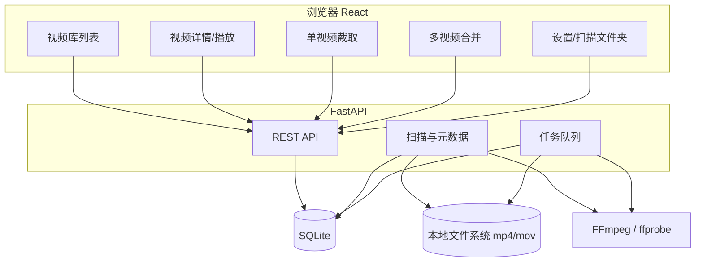

# 个人视频管理工具 — 产品需求文档（PRD）

| 项目 | 内容 |
|------|------|
| 文档名称 | 个人视频管理工具 产品需求文档 |
| 版本 | v1.3 |
| 日期 | 2026-06-01 |
| 状态 | 评审中 |
| 关联文档 | 数据库、API、FFmpeg 策略、工程约定 `dev-guide.md`；`design.md` 仅备份 |
| 架构方案 | 本地 Web：Python FastAPI + SQLite + React + FFmpeg |

> 说明：本文档为产品需求规格，描述「做什么、为谁做、做到什么程度」，不包含建表 SQL 与字段类型，数据存储细节见数据库设计文档。

---

## 1. 产品概述

### 1.1 背景与问题

用户在 Windows 单机上积累了 5 万以上的本地视频文件，单文件 100MB～2GB，格式为 mp4 与 mov。当前存在以下问题：

- 文件分散在同一盘符下的多个文件夹，目录结构与命名都比较混乱。
- 没有有效手段精准检索目标视频，只能靠记忆和手动翻找。
- 缺少统一入口对视频进行观看、归类与基础剪辑。

### 1.2 产品目标

提供一个本地运行的 Web 工具，使用户能够：

1. 把指定文件夹纳入管理并建立可检索的视频索引。
2. 分页浏览、播放视频，并通过人工标注（分类、标签、录制起止时间、喜爱度）建立检索维度。
3. 基于标注进行多条件检索与排序，快速定位目标视频。
4. 对视频进行单段截取、多视频合并；v1 保留原文件，由用户手动删除。

### 1.3 目标用户与使用场景

| 项目 | 说明 |
|------|------|
| 用户 | 仅本人，单机使用，无多用户/协作需求 |
| 运行环境 | Windows 10/11，本地浏览器访问 `http://localhost:8765` |
| 典型场景 | 整理历史视频；观看时打标签；按标签/时间/喜爱度找视频；截取片段或合并多段素材 |

### 1.4 范围与非目标

**v1 范围：** 文件夹扫描与索引、分页列表与第一帧预览、播放、标注、多条件检索与排序、单视频单段截取、多视频合并（concat demuxer）、打开文件所在目录、任务进度；剪辑/合并后**保留原文件**。

**v1 非目标（明确不做）：**

- 云端同步、账号体系、多用户与权限
- 人脸识别、FFmpeg 抽帧生成缩略图
- 未标注专用队列、标签颜色/图标
- 自动扫描整个盘符、自动文件夹监听
- mp4、mov 以外的格式
- 录制时间自动识别（OCR）——列为 P1 候选

---

## 2. 名词术语表

| 术语 | 定义 |
|------|------|
| **扫描文件夹** | 用户手动添加、纳入管理的本地目录。仅这些目录会被扫描 |
| **增量扫描** | 再次扫描某文件夹时，仅处理新增、变更、缺失的文件，不重复导入未变文件 |
| **快速扫描** | 仅登记文件路径/文件名/大小/修改时间，不读取媒体元数据，耗时极短 |
| **元数据补全** | 后台对文件逐个执行 ffprobe，补全时长、分辨率等信息 |
| **录制起止时间** | 视频**画面内**显示的录制开始/结束时刻（OSD 烧录时间），由用户人工录入，可为空 |
| **喜爱度** | 用户对视频的偏好评分，0～10 整数，0 表示未设置 |
| **第一帧预览** | 列表当前页（最多 100 条）由浏览器加载视频流截取首帧，不落盘；翻页释放上一页预览 |
| **playback_supported** | 后端根据 ffprobe 编码判断浏览器是否可直接播放 |
| **missing（缺失）** | 数据库有记录但磁盘文件已删除/移走的视频状态 |
| **_temp 目录** | 单视频截取输出在源目录下 `_temp` 子文件夹；扫描时跳过 `_temp` |
| **打开所在目录** | 详情页打开 Windows 资源管理器并定位到该视频文件 |

---

## 3. 整体功能架构

---

## 4. 功能需求（FR）

> 每条功能需求包含：描述、规则、优先级、验收标准。优先级 P0 = 首版必做，P1 = 后续迭代。

### FR-1 扫描文件夹管理

**描述：** 用户可在「设置」中通过 **Windows 文件夹选择对话框** 添加、删除、启用/停用扫描文件夹（同一盘符下可配置多个）。

**规则：**
- 添加路径：调用系统弹窗选择目录，**不需要**拖拽或手输路径（界面只读展示已选路径）。
- 路径为本地绝对路径，重复路径不可添加。
- 仅启用状态的文件夹参与扫描。
- 未添加的目录不会被扫描。

**优先级：** P0

**验收标准：**
- AC-1.1 通过弹窗选择合法路径后，列表出现该文件夹，状态为「未扫描/idle」。
- AC-1.2 添加已存在路径时，系统拒绝并提示重复。
- AC-1.3 添加不存在或无权限路径时，系统提示错误且不入库。
- AC-1.4 停用某文件夹后，「扫描全部」不再处理该文件夹。
- AC-1.5 删除文件夹时提示是否同时移除其下视频记录，用户可选择保留或清除。

### FR-2 增量扫描

**描述：** 对单个文件夹或全部启用文件夹执行扫描，仅处理变化项。

**规则：**
- 新增文件 → 新建视频记录。
- 文件大小或修改时间变化 → 更新元数据，但保留分类、标签、录制起止时间、喜爱度。
- 文件已删除/移走 → 标记为 missing。
- v1 不自动监听，扫描由用户手动触发。
- 递归扫描时**跳过**名为 `_temp` 的子目录（截取输出目录）。

**优先级：** P0

**验收标准：**
- AC-2.1 文件夹新增 1 个视频后扫描，仅该视频被新增入库，已有记录不重复。
- AC-2.2 替换某文件内容（大小/mtime 变化）后扫描，其元数据更新且标注信息不丢失。
- AC-2.3 删除磁盘上某视频后扫描，对应记录被标记 missing。
- AC-2.4 未发生变化的文件再次扫描不产生重复记录、不重复 ffprobe。
- AC-2.5 扫描过程中显示进度，结束后更新文件夹的「上次扫描时间」与状态。

### FR-3 视频索引（mp4/mov）

**描述：** 扫描时递归发现 mp4、mov 文件并登记，随后补全媒体元数据。

**规则：**
- 扩展名匹配 `.mp4`、`.mov`，大小写不敏感。
- 采用两段式：先快速扫描登记基础信息，再后台元数据补全（时长、分辨率）。
- 元数据状态：pending / ready / failed。
- 元数据补全记录是否存在音频轨（`has_audio`）；无音频轨的视频在截取/合并时被拦截。

**优先级：** P0

**验收标准：**
- AC-3.1 文件夹内 mp4 与 mov 均被发现入库，其他格式被忽略；`_temp` 目录内文件不被扫描入库。
- AC-3.2 快速扫描完成后即可在列表看到视频，元数据未就绪项显示「解析中」。
- AC-3.3 元数据补全后，时长与分辨率正确显示（与 ffprobe 结果一致）。
- AC-3.4 ffprobe 失败的视频标记 failed，不阻塞其他视频。
- AC-3.5 单文件夹（≤500 文件）快速扫描在数秒内完成。

### FR-4 列表与第一帧预览

**描述：** 分页展示视频，默认以第一帧作为预览图。

**规则：**
- 分页默认每页 24 或 48，**单页最大 100**。
- **并发取帧上限 = 当前页条数（≤100）**：仅对当前页视频发起首帧加载；翻页或切换筛选时取消/释放上一页未完成的预览请求。
- 预览由浏览器通过 Range 流加载视频并截取首帧（`currentTime=0` 或首个可解码帧）；失败回退占位图。
- 列表项展示：预览、文件名、时长、分辨率、录制起止时间、喜爱度、分类、标签。
- 支持网格与列表两种视图。

**技术说明（TD-1）：** 5 万总量通过分页隔离，不会同时加载 5 万路预览；单页 100 为设计上界，在可接受范围内。

**优先级：** P0

**验收标准：**
- AC-4.1 列表分页正确，翻页后展示对应页数据。
- AC-4.2 可成功取帧的视频显示首帧预览。
- AC-4.3 取帧失败的视频显示占位图而非破损图标。
- AC-4.4 列表首屏（仅查询数据库部分）在 500ms 内返回。
- AC-4.5 各列表项正确展示时长、分辨率、喜爱度星级、录制时间与标注。
- AC-4.6 单页设为 100 条时，列表可正常浏览，浏览器不因同时 100 路预览请求而无响应（允许部分项显示占位图）。
- AC-4.7 翻页后上一页预览请求被释放，不继续占用带宽。

### FR-5 检索与排序

**描述：** 支持按分类、标签、关键词、录制时间范围、喜爱度进行筛选与排序。

**规则：**
- 分类：单选筛选。
- 标签：多标签 AND（同时含全部所选标签）。
- 关键词：匹配文件名/路径。
- 录制时间：按录制开始时间范围、录制结束时间范围筛选；仅匹配对应字段非空的记录；提供「仅未填录制时间」筛选。
- 喜爱度：按最低等级筛选（如 ≥8，范围 1～10）；可按喜爱度升/降序排序。
- 各条件可组合。
- missing 视频默认是否隐藏：见 §6 边界规则（默认隐藏，可切换显示）。

**优先级：** P0

**验收标准：**
- AC-5.1 选择某分类，仅返回该分类视频。
- AC-5.2 选择多个标签，仅返回同时包含全部所选标签的视频。
- AC-5.3 关键词可匹配文件名或路径中的子串。
- AC-5.4 设置录制开始时间范围，仅返回录制开始时间落在区间内的视频；录制开始时间为空的视频不出现。
- AC-5.5 设置「喜爱度 ≥8」，仅返回 8～10 的视频。
- AC-5.6 多条件组合时结果为各条件交集。
- AC-5.7 按喜爱度排序时顺序正确。

### FR-6 播放

**描述：** 在浏览器内直接播放 mp4/mov，支持拖动进度。

**规则：**
- 后端以 HTTP Range 流式提供视频，不一次性读入内存。
- 提供基本控制：播放/暂停、进度、音量。
- 元数据补全后，后端根据 `video_codec` / `audio_codec` 计算 `playback_supported`（见 TD-2）。
- `playback_supported = false` 时，播放器区域显示明确提示（编码不支持），不静默失败；v1 不做服务端实时转码（列为 P1）。

**技术说明（TD-2）：** v1 判定规则（Chrome/Edge）：视频 `h264` + 音频 `aac` 且容器为 mp4/mov → 可播；`hevc`/`prores` 等 → 不可播。具体映射见 API 文档。

**优先级：** P0

**验收标准：**
- AC-6.1 点击 `playback_supported=true` 的视频可在浏览器内播放。
- AC-6.2 拖动进度条可从指定位置继续播放（Range 生效）。
- AC-6.3 2GB 级文件播放不导致后端内存异常增长。
- AC-6.4 `playback_supported=false` 时显示「当前编码浏览器无法播放」及编码信息。
- AC-6.5 列表/详情接口返回 `playback_supported` 字段，与播放行为一致。

### FR-7 标注（分类 / 标签 / 录制起止时间 / 喜爱度）

**描述：** 在详情页对视频进行标注。

**规则：**
- 分类：每个视频 0 或 1 个，可新建分类。
- 标签：每个视频 0～N 个，输入时对已有标签自动补全，可新建标签。
- 录制开始时间、录制结束时间：均可选，格式 `YYYY-MM-DD HH:MM:SS`，可只填其一、都填或都不填，可清空；**按画面字面时间存储，不做时区转换**（见 TD-3）。
- 喜爱度：0～10 整数，0 表示未设置。
- 标注变更立即持久化。

**优先级：** P0

**验收标准：**
- AC-7.1 设置/更换/清除分类后刷新仍保留。
- AC-7.2 添加多个标签并保存，再次进入显示一致；输入已有标签前缀出现补全建议。
- AC-7.3 单独填写录制开始时间（不填结束）可成功保存，结束为空。
- AC-7.4 清空录制时间后字段恢复为空，且该视频从录制时间范围筛选结果中排除。
- AC-7.5 设置喜爱度星级后，列表与详情同步显示对应星级。

### FR-8 单视频单段截取

**描述：** 从单个视频中截取一段，输出到源目录下 `_temp` 文件夹；**不替换、不删除**原视频。

**规则：**
- v1 **不做**多段一次性截取合并；每次仅截取**一段**。
- 输入：**开始时间**（必填，秒）；**结束时间**（可选，不填则到视频末尾）。
- 输出路径：`{源视频目录}/_temp/{输出文件名}`，`_temp` 不存在则自动创建。
- 默认输出文件名与源视频 `file_name` 相同，用户可修改；扩展名与源一致（mp4/mov）。
- `_temp` 内若已存在同名文件 → **直接覆盖**（源文件不会在 `_temp`，扫描已排除该目录）。
- 截取后**原视频保留**，v1 由用户手动删除；输出文件默认不自动更新库内原记录。
- FFmpeg：`-ss` 放在 `-i` 之后（输出侧 seek，保证切点精准）；`-c copy` 保持编码一致（详见 FFmpeg 策略文档）。
- 无音频轨（`has_audio=false`）时禁止提交截取任务。

**优先级：** P0

**验收标准：**
- AC-8.1 仅填开始时间时，输出视频从该时刻持续到源文件末尾，内容正确。
- AC-8.2 填写开始与结束时间时，输出时长与区间一致（允许 copy 模式下极小偏差）。
- AC-8.3 输出文件位于源目录 `_temp` 下，扩展名与源一致。
- AC-8.4 截取成功后源视频文件仍在原路径，数据库原记录不变。
- AC-8.5 默认文件名为源文件名，可修改后生效。
- AC-8.8 再次截取且输出同名时，`_temp` 内旧文件被覆盖。
- AC-8.6 无音频轨视频提交截取时被拒绝并提示。
- AC-8.7 任务失败时源文件不受影响。

### FR-9 多视频合并

**描述：** 选择多个视频按顺序合并为一个新文件；**concat demuxer + stream copy**；原视频全部保留。

**规则：**
- 用户多选并调整顺序；至少 2 个视频。
- 合并前预检：各源视频 **video_codec、audio_codec、width、height** 必须一致，否则**拦截不允许合并**（不转码 fallback）。
- 各源视频须 **has_audio=true**，否则拦截。
- 输出目录：排序后**第一个视频**所在目录；默认文件名为第一个视频文件名（可修改）。
- 合并成功后**不删除**源文件，不自动将源记录标为 missing；合并产物是否入库由用户后续扫描决定。
- FFmpeg 实现见 `2026-06-01-video-manager-ffmpeg-strategy.md`。

**优先级：** P0

**验收标准：**
- AC-9.1 编码参数一致时，合并文件按选择顺序拼接正确。
- AC-9.2 编码参数不一致时，提交前或提交时返回明确错误，**不执行** FFmpeg。
- AC-9.3 合并完成后全部源文件仍在原路径。
- AC-9.4 默认文件名为第一个源文件名，可修改。
- AC-9.5 无音频轨的任一源视频参与合并时被拒绝。
- AC-9.6 合并失败时所有源文件保持原位。

### FR-10 合并预检（编码一致性）

**描述：** 多视频合并前，由后端比对各源视频编码参数，不一致则禁止合并。

**规则：**
- 比对字段：video_codec、audio_codec、width、height（均来自元数据补全结果）。
- 提供独立预检接口或在 `merge-videos` 提交时同步校验。
- 错误提示需说明哪些字段不一致。

**优先级：** P0

**验收标准：**
- AC-10.1 两文件分辨率不同时，返回 CODEC_MISMATCH，不创建合并任务。
- AC-10.2 两文件 video_codec 不同时，同样拦截。
- AC-10.3 全部一致时，允许进入合并任务队列。

### FR-11 任务与进度

**描述：** 区分轻量扫描与重型 FFmpeg 任务，提供进度与状态反馈。

**规则：**
- 单文件夹扫描：同步快速扫描 + 后台元数据补全，前端显示进度。
- 扫描全部文件夹：顺序处理各文件夹，显示总进度。
- 单视频截取 / 多视频合并：进入任务队列，单并发执行，避免磁盘/CPU 打满。
- 任务状态：排队、进行中、成功、失败；失败可重试。

**优先级：** P0

**验收标准：**
- AC-11.1 扫描时显示「已处理/总数」进度。
- AC-11.2 FFmpeg 任务同一时刻最多并发 1 个（v1）。
- AC-11.3 任务可查看状态，失败项展示错误并可重试。
- AC-11.4 重型任务执行时界面不被阻塞，可继续浏览。

### FR-P1 后续迭代（非 v1）

| 编号 | 功能 | 说明 |
|------|------|------|
| FR-P1-1 | Windows 系统缩略图 | 读取资源管理器缩略图缓存 |
| FR-P1-2 | 批量打标签 | 多选视频统一加标签 |
| FR-P1-3 | 扫描排除规则 | 跳过临时目录等 |
| FR-P1-4 | 录制时间 OCR 辅助 | 自动识别画面时间并回填 |
| FR-P1-5 | 定时/监听扫描 | 自动发现新增文件 |
| FR-P1-6 | 回收站自动替换 | 截取/合并后自动替换源文件并移入回收站 |
| FR-P1-7 | 多段截取合并 | 一次任务内多段截取并拼接 |

### FR-12 打开文件所在目录

**描述：** 在视频详情页提供按钮，在 Windows 资源管理器中打开该视频所在文件夹并选中文件。

**规则：**
- 仅 Windows 本地环境；调用系统默认方式（如 `explorer /select,`）。
- 文件 missing 时按钮禁用或提示文件不存在。

**优先级：** P0

**验收标准：**
- AC-12.1 点击后资源管理器打开且选中当前视频文件。
- AC-12.2 missing 视频点击时提示无法打开。

### FR-13 无音频轨拦截

**描述：** 业务上不存在「故意保留的无音频视频」；若 ffprobe 检测到无音频轨，禁止截取与合并。

**规则：**
- 元数据补全写入 `has_audio`。
- 截取、合并、合并预检均校验 `has_audio=true`。
- 列表/详情可展示「无音频」标识（可选）。

**优先级：** P0

**验收标准：**
- AC-13.1 has_audio=false 的视频无法创建 video_clip 或 merge_videos 任务。
- AC-13.2 错误信息明确为无音频轨。

---

## 5. 非功能需求（NFR）

| 编号 | 类别 | 要求 |
|------|------|------|
| NFR-1 | 性能 | 列表首屏（仅查库）≤ 500ms；单文件夹（≤500）快速扫描 ≤ 2s |
| NFR-2 | 容量 | 支持 5 万+ 视频记录，分页浏览不卡顿 |
| NFR-3 | 并发 | FFmpeg 任务单并发，避免资源打满 |
| NFR-4 | 安全 | v1 剪辑不自动删除源文件；合并前编码预检防误操作 |
| NFR-5 | 兼容性 | Windows 10/11；主流浏览器；mp4/mov |
| NFR-6 | 可靠性 | 任务失败不破坏源文件；扫描可中断后续扫 |
| NFR-7 | 可维护性 | 前后端分离；元数据与标注分层存储 |

---

## 6. 状态与边界规则

| 规则 | 说明 |
|------|------|
| missing 显示 | 列表默认隐藏 missing 视频，提供开关查看 |
| metadata_status | pending（待解析）/ ready（已就绪）/ failed（解析失败） |
| 编码不一致 | 多视频合并预检拦截，不执行 concat |
| _temp 目录 | 扫描跳过；截取输出仅写入 _temp |
| 标注保留 | 重新扫描变更文件时，分类/标签/录制时间/喜爱度不丢失 |
| 路径唯一 | 以文件绝对路径作为视频唯一标识 |
| 录制时间筛选 | 仅作用于对应字段非空的记录；字符串按 `YYYY-MM-DD HH:MM:SS` 字典序比较 |

---

## 6.1 技术决策摘要

| 编号 | 议题 | 决策 |
|------|------|------|
| **TD-1** | 列表首帧预览 | 浏览器当前页取帧；单页最大 100，翻页释放；不做服务端抽帧缓存 |
| **TD-2** | mov/编码兼容 | 接口返回 `playback_supported`；不可播时明确提示；转码播放为 P1 |
| **TD-3** | 录制起止时间存储 | `YYYY-MM-DD HH:MM:SS` 本地字面量，不做 UTC/时区转换 |
| **TD-4** | FFmpeg 剪辑策略 | 见 `2026-06-01-video-manager-ffmpeg-strategy.md`：单段截取、concat demuxer、原文件保留、无音频/编码拦截 |
| **TD-5** | 数据库外键 | 不使用；完整性由应用层保证（见数据库设计文档） |

---

## 7. 用户流程与页面

### 7.1 页面清单

| 页面 | 主要内容 |
|------|----------|
| 视频库 | 分页卡片/列表；分类、标签、录制时间、喜爱度筛选与排序；多选合并入口 |
| 视频详情/播放 | 播放器；标注；**打开文件所在目录**；进入截取 |
| 单视频截取 | 开始/结束时间；输出文件名；提交截取至 `_temp` |
| 多视频合并 | 已选列表排序；预检编码；新文件名；提交合并 |
| 设置 | 扫描文件夹管理（增删/启用/单文件夹扫描/全部扫描）；任务历史 |

### 7.2 关键流程

**索引与浏览：** 添加扫描文件夹 → 快速扫描登记 → 后台元数据补全 → 列表分页浏览。

**观看与标注：** 列表进入详情 → 播放观看 → 设置分类/标签/录制时间/喜爱度 → 保存 → 可按条件检索。

**单视频截取：** 打开视频 → 输入开始/结束时间 → 确认输出名 → 后台截取至 `_temp` → 原文件保留。

**多视频合并：** 多选视频 → 预检编码一致 → 排序 → 输入文件名 → 后台 concat 合并 → 源文件保留。

---

## 8. 里程碑与分期

| 阶段 | 内容 |
|------|------|
| Phase 1 | 项目骨架、扫描文件夹、快速扫描、分页列表、第一帧预览 |
| Phase 2 | ffprobe 元数据、录制起止时间、喜爱度、播放、分类/标签、检索排序 |
| Phase 3 | 单视频单段截取 + `_temp` 输出 |
| Phase 4 | 多视频合并（concat demuxer）+ 预检 + 任务队列 |
| Phase 5 | 设置页、增量扫描联调、Windows 实测 |

---

## 9. 风险与对策

| 风险 | 对策 |
|------|------|
| 5 万视频首次扫描慢 | 快速扫描 + 后台元数据补全；增量扫描 |
| 录制时间依赖人工录入 | 提供「未填录制时间」筛选便于补录；P1 OCR 辅助 |
| 第一帧预览失败 | 自动回退占位图；P1 接系统缩略图 |
| 编码不一致仍发起合并 | 提交前预检 CODEC_MISMATCH |
| _temp 被扫描重复入库 | 扫描规则跳过 `_temp` 目录 |
| 浏览器播放大文件 | Range 流式，避免整文件读内存 |

---

## 10. 附录：已确认项

- [x] 扫描文件夹：Windows **弹窗选择**目录（见 dev-guide）
- [x] 喜爱度：**0～10**，0 为未设置
- [x] 合并默认文件名：排序后**第一个**源文件名，用户可手工修改，无自动后缀
- [x] `_temp` 截取同名输出：**覆盖**

---

## 变更记录

| 版本 | 日期 | 说明 |
|------|------|------|
| v1.0 | 2026-06-01 | 由需求草案拆分形成正式 PRD；FR 编号化并补充验收标准 |
| v1.1 | 2026-06-01 | TD-1～TD-5；FR-4/FR-6 修订；关联 API 规格 |
| v1.2 | 2026-06-01 | 单段截取至 _temp、原文件保留；concat demuxer 合并+编码拦截；打开目录；无音频拦截；FFmpeg 策略文档 |
| v1.3 | 2026-06-01 | 喜爱度0-10；扫描弹窗选目录；_temp同名覆盖；dev-guide；design.md仅备份 |
